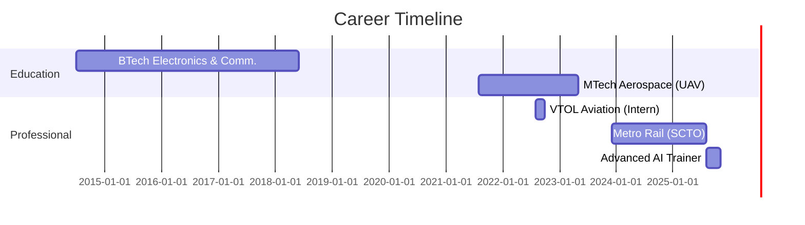

<div align="center">

# 👋 Hey, I'm Gaurav Kumar

### 🚀 Aerospace Engineer → ML Engineer → AI Systems Architect


[](https://www.linkedin.com/in/gauravaero/)
[](https://github.com/GauravAero)
[](mailto:gaurav.aero5@gmail.com)
[](https://www.hackerrank.com/profile/gaurav656ae)


</div>

---

## 🎯 About Me
```python
class MLEngineer:
    def __init__(self):
        self.name = "Gaurav Kumar"
        self.role = "Advanced AI Trainer & ML Engineer"
        self.location = "Delhi NCR, India"
        self.education = {
            "MTech": "Aerospace Engineering (UAV Design) - DIAT Pune",
            "BTech": "Electronics & Communication Engineering"
        }
        
    def current_focus(self):
        return [
            "🤖 Training advanced AI systems (Alignerr, Invisibletech, Mindrift)",
            "🧠 Building multi-agent AI systems with CrewAI & LangChain",
            "📊 Deep Learning for financial predictions & NLP",
            "🛸 Applying aerospace precision to AI problems"
        ]
    
    def specialties(self):
        return {
            "AI_Systems": ["Agentic Workflows", "LLMs", "RAG Systems"],
            "ML_Models": ["Neural Networks", "NLP", "Predictive Analytics"],
            "Domains": ["Finance", "Aerospace", "Data Science"],
            "Accuracy": "90-95% on production models"
        }
```

> 💡 **Unique Edge:** Bridging aerospace engineering precision with cutting-edge AI — from GNSS spoofing to investment advisor agents

---

## 🛠️ Tech Arsenal

<table>
<tr>
<td valign="top" width="50%">

### **AI & Machine Learning**


### **GenAI & LLM Stack**


</td>
<td valign="top" width="50%">

### **Data & Analytics**


### **Cloud & Tools**


</td>
</tr>
</table>

---

## 🚀 Featured Projects

<details open>
<summary><b>🤖 Investment Advisor Agent</b> - Multi-Agent AI System</summary>
<br>

**Built a sophisticated agentic workflow that analyzes stocks and provides investment recommendations**
```python
# Architecture: 4 Specialized AI Agents
agents = {
    "news_explorer": "Gathers latest company news & market sentiment",
    "data_explorer": "Fetches financial data & fundamentals",
    "analyst": "Performs comprehensive analysis",
    "fin_expert": "Generates buy/sell/hold recommendations"
}
```

**Tech Stack:** `CrewAI` `LangChain` `Python` `Yahoo Finance API` `Google Colab`

**Key Achievement:** ✨ Predictions accurately matched real-world market movements

**Impact:** Autonomous system that processes financial data → analyzes trends → provides actionable insights

[🔗 View Project](https://github.com/GauravAero/Investment_Advisor)

</details>

<details>
<summary><b>🏦 Loan Repayment Forecasting</b> - Deep Learning Classification</summary>
<br>

**Predicting loan default risk using Artificial Neural Networks**
```python
# Model Performance
Accuracy: 90%
Model: Deep Neural Network (TensorFlow/Keras)
Features: 20+ financial indicators
Use Case: Risk assessment for financial institutions
```

**Tech Stack:** `TensorFlow` `Keras` `Pandas` `Seaborn` `scikit-learn`

**Business Value:** Saves financial institutions millions by identifying high-risk loans before approval

**Architecture:**
- Input Layer: Income, credit history, DTI ratio, employment length, etc.
- Hidden Layers: Dense layers with dropout regularization
- Output: Binary classification (Will Pay / Won't Pay)

[🔗 View Project](https://github.com/GauravAero/Lending-Club-Project)

</details>

<details>
<summary><b>📧 Spam Detector</b> - NLP Classification System</summary>
<br>

**Natural Language Processing pipeline for message classification**
```python
# Pipeline Architecture
Text → Preprocessing → Vectorization → TF-IDF → Classification
Accuracy: 95%
Messages Processed: 5,572 samples
```

**Tech Stack:** `NLTK` `scikit-learn` `Python` `Pipeline Architecture`

**Technical Highlights:**
- Text preprocessing & tokenization
- TF-IDF vectorization
- Multinomial Naive Bayes classification
- Complete ML pipeline implementation

[🔗 View Project](https://github.com/GauravAero/Spam-Detector)

</details>

<details>
<summary><b>🎬 Movie Recommender System</b> - Collaborative Filtering</summary>
<br>

**Building personalized recommendations using feature engineering**

**Tech Stack:** `scikit-learn` `Pandas` `Feature Engineering`

**ML Concepts:** Matrix Factorization, User-Item Interactions, Collaborative Filtering

[🔗 View Project](https://github.com/GauravAero/Recomender-System)

</details>

<details>
<summary><b>💰 Financial Data Analysis</b> - Interactive Dashboards</summary>
<br>

**Stock market analysis with visualization**

**Tech Stack:** `Plotly` `Pandas` `Python`

[🔗 View Project](https://github.com/GauravAero/Finance-Project)

</details>

<details>
<summary><b>🚨 911 Emergency Call Analysis</b> - Data Exploration</summary>
<br>

**Analyzing emergency response patterns**

**Tech Stack:** `Pandas` `Matplotlib` `Seaborn`

[🔗 View Project](https://github.com/GauravAero/911-Call-Project)

</details>

---

## 📊 GitHub Analytics

<div align="center">


</div>

<div align="center">

[](https://git.io/streak-stats)

</div>

---

## 💼 Professional Journey


### 🤖 **Advanced AI Trainer** | *Aug 2024 - Present*
**Alignerr • Invisibletech • Mindrift • DataAnnotation.tech**
- Training & evaluating advanced AI models for production systems
- Specialized in coding tasks, reasoning, and technical problem-solving
- Working with cutting-edge LLMs and GenAI technologies

### 🚇 **Systems Control Technical Officer** | *Dec 2023 - Aug 2024*
**Uttar Pradesh Metro Rail Corporation, Kanpur**
- Managed metro rail operations and control systems
- Technical solutions for urban transit infrastructure

### ✈️ **Project Intern** | *Aug 2022 - Oct 2022*
**VTOL Aviation India Pvt Ltd, Navi Mumbai**
- Successfully jammed Upper L-Band GNSS signals
- Demonstrated GPS control takeover via jamming & spoofing
- Aerospace R&D in UAV navigation systems

---

## 🏆 Certifications & Achievements

<table>
<tr>
<td width="50%">

### 🎓 **Academic Excellence**
- 🥇 **MIT** - Machine Learning with Python
- 📊 **Google** - Data Analytics Professional
- 🐍 **Google** - IT Automation with Python
- 💻 **HackerRank** - Python & SQL Certified

</td>
<td width="50%">

### 📈 **Project Highlights**
- ✅ 90% accuracy on loan prediction
- ✅ 95% accuracy on spam detection
- ✅ Real-world investment predictions
- ✅ Multi-agent AI systems deployed

</td>
</tr>
</table>

---

## 📚 Knowledge Base

<div align="center">

| **Domain** | **Expertise Level** | **Projects** |
|:---|:---:|---:|
| Machine Learning | ⭐⭐⭐⭐⭐ | 6+ Production Models |
| Deep Learning | ⭐⭐⭐⭐⭐ | TensorFlow, Keras, PyTorch |
| NLP | ⭐⭐⭐⭐ | Classification, TF-IDF |
| Agentic AI | ⭐⭐⭐⭐⭐ | CrewAI, LangChain |
| Data Science | ⭐⭐⭐⭐⭐ | Pandas, SQL, Visualization |
| Cloud Platforms | ⭐⭐⭐⭐ | AWS, GCP |
| Aerospace Engineering | ⭐⭐⭐⭐ | UAV Design, GNSS |

</div>

---

## 🌟 What Makes Me Different

<table>
<tr>
<td width="33%" align="center">

### 🎯 **Precision**
Aerospace engineering background brings unmatched attention to detail and systematic problem-solving

</td>
<td width="33%" align="center">

### 🚀 **Innovation**
From UAV design to AI agents — constantly pushing boundaries across domains

</td>
<td width="33%" align="center">

### 📈 **Results**
90-95% model accuracy isn't luck — it's methodical engineering meets data science

</td>
</tr>
</table>

---

## 📫 Let's Build Something Amazing

<div align="center">

### 💬 **Open For:**
`ML Engineering Roles` • `AI Research Collaborations` • `Data Science Projects` • `Consulting Opportunities`

<br>

[](https://www.linkedin.com/in/gauravaero/)
[](mailto:gaurav.aero5@gmail.com)
[](https://github.com/GauravAero)

<br>

### ⚡ **"From spacecraft to neural networks — engineering intelligence, one model at a time"** ⚡

<br>


</div>
